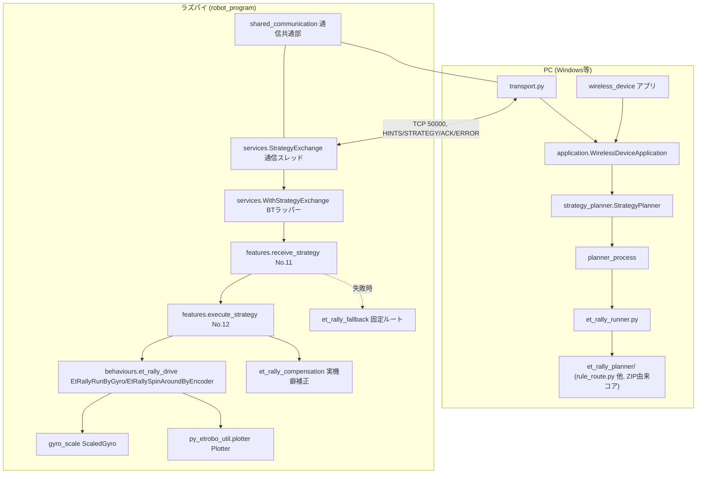
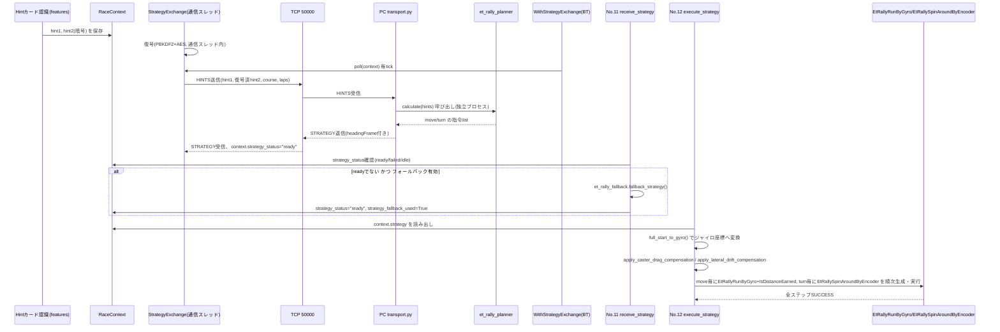
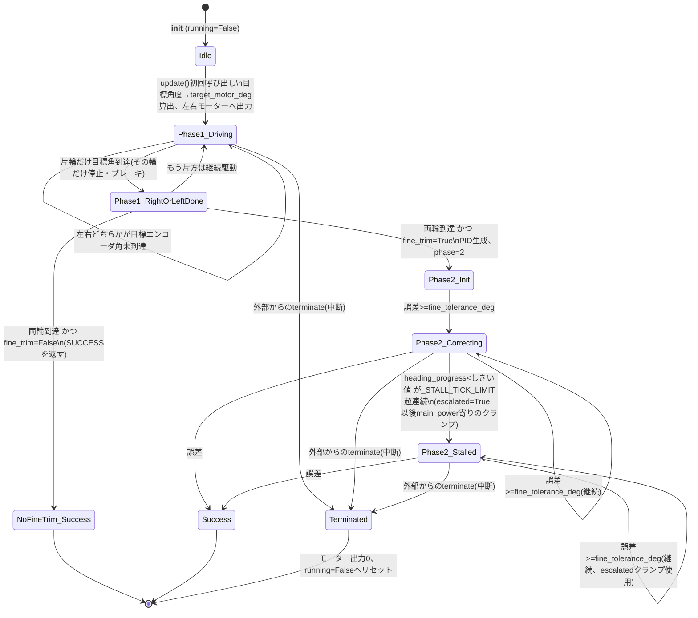
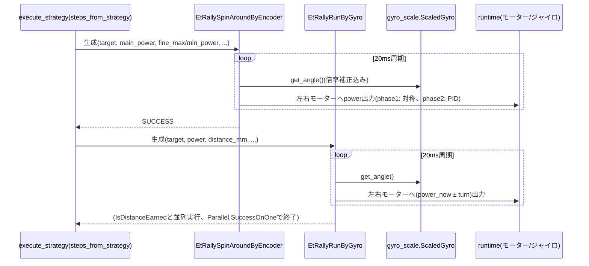

# ETラリー モデル図作成のための調査資料 v1(2026-09-26)

ETロボコン2026 応用クラス CS大会モデル審査(A3横6枚: 1アブストラクト/2要求/3システム分析/4設計①/5設計②/6制御)のうち、
主に4〜6枚目の材料を、現行コード・コミット履歴・既存設計メモから抽出した調査資料。
**この資料自体はコード変更を伴わない。プログラムの変更・リファクタリング・コミット・pushは行っていない。**

読み方: 「実装」「設計意図(記録)」「試作/不採用」「実機確認済み」「PC上/モック確認のみ」「推測」「未確認」を、本文中で区別して明記する。
理由の記録が無いものは「理由の記録なし」と書く。他資料からの推測には推測である旨を付す。

---

## 1. 調査範囲と確認できなかった範囲

### 1.1 調査対象リポジトリとブランチの状態

- リポジトリ: `C:\Users\MSAD\EV3RT`、対象コードは `2026-Alpha/`。
- 調査時点のブランチ: `devSS`。`git status -sb` は `## devSS...origin/devSS`(未コミット差分なし、クリーン)。
- 調査時点のHEAD: コミット `d4a2c24`(2026-09-22 15:00:48 +0900、「ETラリーのスタート位置をさらに調整」)。ローカルとリモート`origin/devSS`は一致。
- 他ブランチの存在は確認した(`devAT`、`devSS-merge`、`master`、および`origin/`配下に`devAK`/`devAT`/`devMA`/`devRE`/`devSS`/`devTK`/`devTO`/`devWT`/`teamA_main`)が、今回の調査は`devSS`のみを対象とし、他ブランチの内容比較は行っていない。
- `wireless_device/et_rally_planner/`(経路計算コア: `rule_route.py`/`config.py`/`planner.py`/`geometry.py`/`commands.py`)へのコミットは13件(`83e65a1`〜`d4a2c24`)。ログを`git log --format="%h %ai %s" -- 2026-Alpha/wireless_device/et_rally_planner`で全件確認済み(本資料3節の年表に反映)。

### 1.2 参照した記録・コード

- `2026-Alpha/docs/notes/` 配下のMarkdown一式(同ディレクトリの`README.md`が更新履歴の索引、`PROJECT_README.md`が入口)。特に`wireless_device/README.md`、`robot_program/README.md`、`robot_program/ET_RALLY_DRIVE_STANDALONE_v1.md`、`shared_communication/README.md`、`shared_communication/INTEGRATION_GUIDE_v2.md`、`MISSION_SELECTION_v6.md`、`RACE_STARTUP_v2.md`、`PROJECT_README.md`を通読した。
- 現行ソース: `wireless_device/`(`transport.py`、`application.py`、`strategy_planner.py`、`planner_process.py`、`et_rally_runner.py`、`et_rally_planner/*.py`)、`shared_communication/`(`protocol.py`、`heading_frame.py`)、`robot_program/`(`config.py`、`context.py`、`tree_builder.py`、`phases/et_rally.py`、`features/receive_strategy.py`、`features/execute_strategy.py`、`services/strategy_exchange.py`、`services/strategy_tree.py`、`behaviours/et_rally_drive.py`、`behaviours/encoder_spin.py`、`behaviours/corrected_run.py`、`et_rally_compensation.py`、`et_rally_fallback.py`、`gyro_scale.py`、`tests/test_et_rally_fallback.py`)、`py_etrobo_util/plotter.py`、`alpha.py`を読み、行番号を確認した。
- 本セッション内で添付された2件の引き継ぎメモ(以下「引継A」「引継B」と呼ぶ)を、テキストとして読める範囲で参照した。
  - **引継A** = `SESSION_HANDOFF_2026-09-20.md`。**このファイルはdevSSリポジトリの外**、`C:\Users\MSAD\et_rally_planner\`(引継A自身の記載によれば「gitリポジトリ: なし」)で書かれた記録であり、`git`で追跡できない。今回の調査でこのフォルダを直接読み直してはおらず、添付テキストをそのまま「読めた記録」として扱った。
  - **引継B** = `SESSION_HANDOFF_2026-09-22.md`。本セッション(devSS環境)自身が今回より前の時点で作成したファイルで、`docs/notes/`ではなく`C:\Users\MSAD\et_rally_planner\`に保存されている(devSSの外)。内容は本調査で再検証した`d4a2c24`までのコミット・現行コードと突き合わせ、矛盾は見つからなかった(3節・9節に反映)。
- コミット`83e65a1`(2026-09-13、`wireless_device/et_rally_planner/`の初回追加)のメッセージに「Markdownをdocs/notesへ集約、旧担当コード・診断ツールをarchiveへ移設」とあり、`wireless_device/README.md`に「`et_rally_planner/`: ZIPから取り出した現行の計算本体」と明記されている。これと引継Aの記述(非git環境`C:\Users\MSAD\et_rally_planner\`で`rule_route.py`等を開発)を突き合わせると、**現行の経路計算コアは、引継Aが記録している非git環境での開発成果物がZIP経由でdevSSへ持ち込まれたもの**と判断できる(推測の余地はあるが、ファイル名・関数名・設計方針(ゲート中心を垂直に通る、T字パーツ3cm/4cm、`GOAL_FINAL_TURN=False`等)が現行コードと一致するため、強い根拠がある)。ただしZIP取り込みの厳密な対応(どの時点のどのファイル一式か)はコミット差分から機械的に確認したものではなく、**推測**である。
- コミット`7fa1756`(2026-09-20「plannerをローカル最終版(斜め候補・高速化)へ同期」)、`d0384fd`(同日「probe(黒線位置リセット)関連を削除」)は、引継Aが記述する「寄り道(probe)は不採用」「斜め候補・高速化の最終版」という決定と、日付・内容とも一致する。これはdevSS外の非git環境での開発成果が、この2コミットでdevSSへ反映されたことを示す強い状況証拠である。

### 1.3 確認できなかった範囲・調査しなかった範囲

- **`C:\Users\MSAD\et_rally_planner\`フォルダそのものの現況**: 非gitのため、今回はこのセッションの中で直接読み直していない(添付の引継Aテキストのみを参照)。このフォルダに、devSSへ未反映の後続作業が残っている可能性は否定できない(**未確認**)。
- **他ブランチ(`devTK`/`devAT`等)のET関連コードとの差分**: 調査していない。`027ac0c`(2026-09-20「devTKをベースにdevSSのETラリー修正(planner/runtime)をマージ」)というマージコミットが存在することから、devTKとdevSSの間で相互反映が行われていたことは分かるが、現時点の差分は未調査。
- **実機ログの生データ**: 本資料は、直前までの会話記録・コード内コメントに記載された実測値(例: タイヤ径較正、キャスター引きずり量、ジャイロ倍率)を根拠として引用しているが、`run_logs/`配下の生ログファイルそのものを本調査で再度開いてはいない(`run_logs/`は`.gitignore`でGit管理対象外)。個々の実測値は、コード内コメントに数値と実施日が明記されている範囲でのみ「実機確認済み」と分類した。
- **モデル審査で要求される正式な品質特性表・要求ID体系**: リポジトリ内に正式な要求ID表・品質特性表は見つからなかった(`docs/notes/`はすべて実装メモであり、要求分析ドキュメントではない)。本資料が付与するIDは**すべて仮ID**であり、正式なIDとして扱わないこと。
- **提出済みのモデル図(1〜3枚目の現行版)**: 本セッションに提出物としての添付・参照はなかった。したがって7節「1〜3枚目へ反映すべき事項」は、既存モデルへの「修正確定事項」ではなく、**「照合すべき事項」**として扱う。
- **プランナーの自動リグレッションテスト(`test_rule_route.py`、`stress_test_gate_crossing.py`等)**: これらはリポジトリの`.gitignore`(`2026-Alpha/.gitignore`の`test_*.py`除外規則、コメント「Keep local verification scripts, but do not share them through Git」)により**意図的にGit管理対象外**であり、`git ls-files`では実在しない。600件規模の経路再計算による検証(違反0件、等)は、本セッションの会話記録にのみ残っており、**再実行可能な形でリポジトリには存在しない**(6節・9節で詳述)。

---

## 2. ETラリーの現行構成・動作の要約

ETラリーは、走行体(ラズパイ、以下「ラズパイ」)とPC(Windows等の別マシン)の2台構成で実行される。

1. ラズパイ上の`alpha.py`が、キャリブレーション→タッチ開始→LAPゲート→**ET相撲**→(ボトル取得+Hintカード読取: `bottle_and_rally_preparation`)→**ETラリー**→FINISH、の順で工程を実行する(`robot_program/tree_builder.py:18-66`。ET相撲がETラリーより先に実行される点は`tree_builder.py:56`のコメント「正式な工程順: LAPゲート通過後はET相撲を先に行い、そのあとでボトルキャッチ(AT)へ進む」に明記)。
2. Hintカード1(赤ゲート位置)とHintカード2(青・黄ゲート位置、暗号化)が揃うと、ラズパイの通信スレッド(`robot_program/services/strategy_exchange.py`)がHint2を復号し、TCP(既定ポート50000)でPCへ送信する。
3. PC側(`python -m wireless_device --host <ラズパイIP>`)がHintを受け取り、`wireless_device/et_rally_planner/rule_route.py`のルールベース経路計算で、赤→青→黄を指定周回数ぶん通過してゴールへ至る、絶対方位ベースの走行指令列(`move`/`turn`のlist）を計算して返す。
4. ラズパイは受信した指令列を`robot_program/features/execute_strategy.py`で行動木のノード列(`EtRallyRunByGyro`/`EtRallySpinAroundByEncoder`、`robot_program/behaviours/et_rally_drive.py`)に変換し、実行する。旋回はエンコーダ主導+ジャイロ仕上げの2段階方式、直進はジャイロ方位維持のPID制御。
5. PC通信が失敗・タイムアウトした場合は、`robot_program/et_rally_fallback.py`の固定ルート(スタート→中継点A→B→C→ゴール)でゴール(ガレージ)へ直行する縮退動作がある(既定で有効)。

PC側の経路計算は、ラズパイの20ms制御周期とは完全に独立したプロセスで、Hintが揃ってから走行指令が届くまでの全体上限は**20秒**(`robot_program/config.py:92`、`strategy_timeout_s: float = 20.0`。2026-09-21に5秒から変更、後述DD-11)。

---

## 3. 重要な設計判断の一覧(仮ID)

凡例: 「根拠」列のファイルパスは`2026-Alpha`基準の相対パス。commitはフルにせず短縮ハッシュ。

| ID | 課題 | 検討した候補 | 採用案 | 理由(記録の有無を明記) | 現在の状態 | 根拠 |
|---|---|---|---|---|---|---|
| DD-01 | 経路計算(重い探索)と20ms制御周期の走行体をどう分離するか | (a)ラズパイ上で都度計算 (b)PC側で計算しTCPで指令列だけ渡す | (b) PC側計算・独立プロセス起動・標準入出力JSON契約 | 記録あり: `wireless_device/README.md:34`「計算時だけ独立した短命プロセスを使用する…走行体の20ms制御周期では動作しない」。理由は計算コストの分離とランナー差し替え可能性 | 実装済み・実機での通信結合は`ET_RALLY_DRIVE_STANDALONE_v1.md`の`rally-drive`試験で確認記録あり(実機試験そのものの合否ログは本調査で未取得) | `wireless_device/README.md`、`wireless_device/transport.py:110-150` |
| DD-02 | ゲート通過時の姿勢をどう表現するか | (a)角度・オフセットも探索対象にする (b)常にゲート中心を垂直に通る固定モデル | (b)固定(entry=中心から前方7.5cm、exit=後方18cm) | 記録あり: `rule_route.py:1-13`の設計コメント | 実装済み(現行) | `wireless_device/et_rally_planner/rule_route.py:1-13` |
| DD-03 | 支柱(ゲート脚)の「T字パーツ」への接触・過度接近をどう扱うか | (a)支柱を点として扱う (b)T字パーツを線分(カプセル)として扱い車体3〜4cmの余裕を優先 | (b)。方針は車体前方・側面で3cm以上、目標4cm。後方は評価しない | 記録あり(引継A 2節 決定5「T字パーツとの車体クリアランス: 3cm以上(できれば4cm)…車体の前方だけ評価」)。現行値と一致: `ARM_BODY_CLEARANCE_MIN_CM=3.0`(`config.py:239`)、`ARM_BODY_CLEARANCE_TARGET_CM=4.0`(`config.py:203`)、`ROBOT_REAR_OVERHANG_FOR_CLEARANCE_CM=0.0`(`config.py:213`、後方非評価) | 実装済み。ただし60cmの探索予算内で3cm以上を満たす候補が作れない配置が残存(9節) | `config.py:47,203,213,239`、`rule_route.py:169`台の`_segment_body_clearance` |
| DD-04 | T字パーツ余裕確保の実現方式(経路構築アルゴリズム自体) | (a)旋回軸基準の強い条件(10.85cm)を優先 → (b)3cm未満のときだけ斜め中継点を1つ探索し最短採用 → (c)侵入側8通りの選択で全ゲート3cm以上を予算60cm以内で優先 → (d)回り込み型候補(斜め→通路→垂直→entry軸)を追加 | (d)まで積み重ねた現行方式 | 記録あり(本セッションの会話記録: 赤→青遷移で48.3cm大回りになる配置の指摘→(b)→ゴール区間の課題→(c)→他ゲートを無駄に通り抜ける大回りの指摘→(d)) | 実装済み(600配置規模の非公式再計算で違反0件、詳細は6節・9節) | `cf7e232`,`cb324eb`,`741f656`の各コミット、`rule_route.py:2189`(`_resolve_top_level_segment`)、`2635`(`_search_shortest_arm_safe_detour`)、`2773`(`_try_diagonal_to_entry_axis`) |
| DD-05 | ゴールへの最終区間の経路選択 | (a)進入禁止エリアに入らなければ直接候補を無条件採用 (b)直接候補と中継点C経由候補を作り短い方を採用 | (b) | 記録あり(本セッション: 直接候補が他ゲートを経由する大回りになる配置の指摘) | 実装済み(`a568048`) | `rule_route.py:2859`(`_resolve_goal_segment`)、`2878`(`_resolve_goal_segment_core`) |
| DD-06 | ゴール到達時の姿勢(向き)を規定するか | (a)規定の向きへ旋回してから停止 (b)ゴールに着けば向きは問わない | (b)、`GOAL_FINAL_TURN=False` | 記録あり(引継A 2節決定4「ゴール到達後の旋回は不要」) | 実装済み(現行) | `config.py:208` |
| DD-07 | ETラリー開始位置(スタート)の座標 | 基準位置(シフト0,0)→Y-1cm→Y-1.7cm/X-0.5cm(ETエリア側)→さらにX+1.0cm/Y+0.7cm(ゴール反対方向) | 現行`START_SHIFT_CM=(0.5,-2.0)` | 記録あり: 段階ごとに理由が異なる。最初のY-1cmは理由の記録が薄い(引継A本文に明記なし、**理由の記録なし**扱い)。X-0.5/Y-1.7は「実際のコース確認」に基づく(本セッション会話記録)。最後のX+1.0/Y+0.7は「実走で黄ゲートのゴール側支柱に接触したこと」への対応(本セッション会話記録、コミットメッセージにも明記) | 実装済み(`d4a2c24`)。ロボット側`et_rally_fallback.py`と値を同期させる仕組みが`test_et_rally_fallback.py::test_constants_match_planner_config`で存在 | `config.py:119-131`、`et_rally_fallback.py:24-32`、`cd9bf63`/`74d1edd`/`d4a2c24` |
| DD-08 | 進入禁止エリアの導入とスタート位置移動時の扱い | 進入禁止エリアの境界をスタート位置に追従させる/固定する | 固定(スタート位置を動かしても境界は動かない) | 記録あり(本セッション: 「進入禁止エリアは動かさない」というユーザー指示) | 実装済み | `config.py:149-162`(`KEEP_OUT_RECTS_CM`は`START_POS_CM`ではなく`4*GRID_PITCH_CM+START_OFFSET_CM+14.0`という固定式を直接使用) |
| DD-09 | 公式ヒント座標のYと内部座標のYの対応 | (a)`Y-1`(ゴール側がY=1) (b)`5-Y`(スタート側の高さがY=1) | (b) | 記録あり: 実際のコースで「11のグレーポイントはスタート位置と同じ高さ」と確認したことによる訂正(コミットメッセージに明記) | 実装済み(`e482f54`) | `wireless_device/et_rally_runner.py:11-19` |
| DD-10 | Hint成立からSEQ受信までの全体タイムアウト | 5秒(旧)→20秒 | 20秒 | 記録あり: 「経路計算が3〜4秒かかるため」(コミットメッセージ)。ラズパイ単体では計算に約11秒かかり5秒で失敗した実測が根拠(本セッション会話記録、**PC単独実行なら3〜4秒台**) | 実装済み(`b7d5f4e`) | `robot_program/config.py:92`、`robot_program/services/strategy_exchange.py:19` |
| DD-11 | PC接続・計算失敗時の走行継続方針 | (a)失敗でミッション停止 (b)固定ルートでゴールへ直行するフォールバック | (b)、既定で有効(`et_rally_fallback_enabled=True`) | 記録あり(コード内docstring、`et_rally_fallback.py:1-16`) | 実装済み。**フォールバック走行自体が実機で使われた確認は本調査では確認できず**(PC上の単体テスト`test_et_rally_fallback.py`で構文・幾何は確認済み) | `robot_program/config.py:79`、`robot_program/features/receive_strategy.py:8-36`、`robot_program/tests/test_et_rally_fallback.py` |
| DD-12 | PCなしで固定walk(`plan.json`)を直接実行する手段 | (a)`wireless_device`経由の`--strategy-file`(TCPは使う) (b)ラズパイ単体で`et_rally_strategy_source="file"`を直接選ぶCLI | 既存の(b)の仕組み(`et_rally_strategy_source=="file"`)にCLI引数`--rally-plan-path`を追加して直接選べるようにした | 記録あり(本セッション: 較正試験をPCなしで行いたいという要望) | 実装済み(`85e524b`)。ラズパイ単体で直進・旋回の較正用JSON(`plan_straight_100/200cm.json`、`plan_spin_alternating30.json`等)を`robot_program/tests/`に追加 | `alpha.py:4,1215,1245-1251`、`robot_program/features/execute_strategy.py:79-103` |
| DD-13 | その場旋回の実現方式(位置ズレ対策) | (a)ジャイロ角のみでPID旋回し続ける(`SpinAround`) (b)左右エンコーダを同じ量だけ回す(フェーズ1)+ジャイロで仕上げ(フェーズ2、`EtRallySpinAroundByEncoder`) | (b) | 記録あり: `behaviours/et_rally_drive.py:39-60`のdocstringに、±90度30回の旋回だけで最大約40cmの位置ズレが再現性高く発生したとの記載(実機テスト、日付は「2026-09-12」) | 実装済み。ラップゲート通過後の全工程(ET相撲以降)へ`EncoderSpin`として展開済み(`behaviours/encoder_spin.py`) | `robot_program/behaviours/et_rally_drive.py:35-224`、`robot_program/behaviours/encoder_spin.py` |
| DD-14 | 直進方位保持PIDのゲイン選定 | 案A/B/C(具体的な数値組の比較) | 案B: P=4.0, I=0.6, D=0.06 | 記録あり(引継A 2節決定1、4節): 旧PID(P=1.1,I≈0)では直進中に向きが3〜4°ズレる問題があり、案Bで実機誤差平均±0.5°以内・横ズレ推定-2〜+4mm/区間 | 実装済み(既定値)。**案A/Cとの直接比較試験は行っておらず、案Bが「良かったから採用」という位置づけ**(引継Aに明記) | `robot_program/features/execute_strategy.py:115-124`(`move_pid=(4.0, 0.6, 0.06)`)、`robot_program/behaviours/corrected_run.py:14`(`ET_MOVE_PID`) | 
| DD-15 | 旋回に伴うキャスターの引きずり(前後方向の位置ズレ)の補正 | 無補正/固定量補正(`mm_per_deg`) | 各turn直後のmove距離を、旋回角度×係数だけ延長 | 記録あり: 90度旋回×30回試行(24/24.5/28cm、平均25.5cm=約8.5mm/回)、同方向連続28回では約2cmに収まったことから車体固定のキャスター起因と推定(`et_rally_compensation.py:16-59`) | 実装済み(既定`caster_drag_mm_per_deg=0.0502`)。この0.0502という現行値と、docstringに記載の逆算値0.0944の対応関係は、本調査のソース読解だけでは特定できず(**未確認: 0.0944→0.0502への変更理由・時期が同ファイル内に記録なし**) | `robot_program/et_rally_compensation.py:16-59`、`robot_program/features/execute_strategy.py:120` |
| DD-16 | 旋回に伴う横方向(左右)の位置ズレの補正 | 無補正/旋回方向(A/B)で異なる係数の補正 | move開始方位をわずかに傾けて打ち消す(`sin`近似、上限5度) | 記録あり: A方向0.00496mm/度(安定)、B方向は当初0.01028→本番実走のY残差(4回中3回+5cm前後)を受け0.01278へ引き上げ(docstringに実測経緯が詳細に記載) | 実装済み(既定値`lateral_drift_mm_per_deg_a=0.00496`,`_b=0.01278`,`sign=1.0`)。右コースはA/B係数を入れ替え符号反転(`execute_strategy.py:154-161`) | `robot_program/et_rally_compensation.py:64-124`、`robot_program/features/execute_strategy.py:154-167` |
| DD-17 | ジャイロ・タイヤ径の較正値をどこに、いつ適用するか | 全工程共通/ラップゲート後・ETラリー工程限定で切替 | ジャイロ倍率補正(`GYRO_SCALE_FACTOR=1.00635`)はラップゲート通過後から有効化。タイヤ径(`ET_RALLY_TIRE_DIAMETER=56.87mm`)はETラリー工程の間だけ`Plotter.tire_diameter`を切替 | 記録あり: 90度×28回連続旋回でジャイロ申告値と実角度に約16度の差(2536/2520≈1.00635)、直進100cm指令で実測99.2cm(-0.8%)からの逆算(いずれも「1回のみの試行なので暫定値」と明記) | 実装済み | `py_etrobo_util/plotter.py:14-37`、`robot_program/gyro_scale.py`、`robot_program/phases/et_rally.py:17-52`(`SetTireDiameter`) |
| DD-18 | 走行体⇔PC間の通信プロトコル設計(整合性・タイムアウト・再送) | — | 4バイト長+UTF-8 JSON+CRC32、missionId単位でキャッシュ(最大16件)、初回+再送2回・2秒間隔、全体上限20秒でfailed、LOCAL計算は未実装 | 記録あり(`shared_communication/README.md`に詳細仕様) | 実装済み | `shared_communication/protocol.py`、`robot_program/services/strategy_exchange.py:18-151`、`wireless_device/transport.py` |
| DD-19 | 経路計算(数学座標・反時計回り正)とロボット制御(コース正規化済み絶対方位)の角度規約統一 | — | `heading_frame.py`の`planner_to_full_start`/`full_start_to_gyro`で一括変換、`headingFrame`識別子`full-start-course-normalized-v1`を通信に含め不一致を検出 | 記録あり(`shared_communication/heading_frame.py`のdocstring、`docs/notes`複数箇所に契約の説明) | 実装済み | `shared_communication/heading_frame.py`、`robot_program/services/strategy_exchange.py:106-107` |
| DD-20 | 経路計算の自動検証(600件規模のリグレッション等)をどこに置くか | Gitで管理/ローカルのみ保持 | ローカルのみ保持、`.gitignore`で`test_*.py`を除外 | 記録あり: `.gitignore`コメント「Keep local verification scripts, but do not share them through Git」 | 運用中。ただし本調査時点で**再実行可能な形ではリポジトリに存在しない**(9節) | `2026-Alpha/.gitignore` |

---

## 4. 4枚目(設計モデル①: 全体構成と連携)に掲載する内容と図表案

### 4-1. 設計方針と分析との対応(面積目安10%)

- **伝える結論**: ETラリーは「PC(経路計算)とラズパイ(実行)を通信で疎結合にし、各担当が独立して差し替えられる」構成である。この分離は、経路計算アルゴリズムの反復改善(3節DD-04等、13コミット)を、走行制御コード(behaviours/)に触れずに行えたという実績で裏付けられる。
- **載せる要素**: 「なぜ2台構成か」(20ms制御周期を止めない、`wireless_device/README.md`)、「なぜ計算ランナーを差し替え可能にしたか」(`--planner-runner`、通信コード非変更)を1〜2行で。
- **根拠**: `wireless_device/README.md`(責務表、ランナー契約)。
- **不足情報**: 品質要求(3枚目)との対応IDが未定義のため、ここでは「要求REQ-仮X」のように仮IDで書くしかない。

### 4-2. 全体構成図(面積目安30%、コンポーネント図)

- **主要コンポーネントの責務(表として掲載)**: `wireless_device/README.md`の「ファイルの責務」表をそのまま引用可(`strategy_planner.py`=安定入口、`planner_process.py`=独立プロセス層、`et_rally_runner.py`=変換アダプター、`et_rally_planner/`=計算本体、`transport.py`=TCP/ACK/再送)。ラズパイ側は`robot_program/README.md`6節の階層図(`phases/`=工程内実行順、`features/`=担当機能、`behaviours/`=再利用可能な単一動作、`services/`=通信等の共通サービス)。
- **配置の実際**: 走行体(ラズパイ+実機)、PC(Windows、無線LAN経由でTCP接続)。`shared_communication/README.md`に「直接TCPは信頼できるネットワークで使用する」「SSHトンネル利用時は…」という運用上の配置注記あり。
- **共通処理とETラリー固有処理の境界**: `EtRallyRunByGyro`/`EtRallySpinAroundByEncoder`(`behaviours/et_rally_drive.py`)は、共通の`gyro_drive.py`の`RunByGyro`/`SpinAround`とは**別クラス**として維持されている(docstring「共通のgyro_drive.pyのSpinAround/RunByGyroとは別クラスで、既存クラスの挙動は変えない」)。ET相撲以降の他工程は、`encoder_spin.py`/`corrected_run.py`が`EtRallySpinAroundByEncoder`/`EtRallyRunByGyro`をラップして再利用している。
- **根拠**: `wireless_device/README.md`、`robot_program/README.md`(1,6節)、`robot_program/behaviours/et_rally_drive.py:1-8`。
- **不足情報**: ハードウェア配置(実機の物理配線図)は本調査の対象外。

### 4-3. 主要I/F表(面積目安20%)

| I/F名 | 送信元→受信先 | 用途 | データ構造(要点) | 契機・順序 | 同期/非同期・タイムアウト |
|---|---|---|---|---|---|
| HINTS | ラズパイ通信スレッド→PC | Hint1・復号済みHint2・コース・周回数の送信 | `messageType, missionId, sequenceNumber, sequenceVersion=1, mode="PC", timestamp, payload{hint1,hint2,course,laps}, crc32` | 両Hintが揃った周期にキュー投入、未接続時は再接続を待つ | 非同期(別スレッド)。初回送信+再送2回、2秒間隔 |
| ACK | PC→ラズパイ | HINTS受信確認(計算完了ではない) | `payload{"for":"HINTS"}` | HINTS受信直後 | 非同期。ACK自体にタイムアウトなし |
| STRATEGY | PC→ラズパイ | 経路計算結果の返信 | `payload{selectedLaps, strategy:[{type:"move"/"turn", target_heading_deg, distance_mm?, label}], headingFrame:"full-start-course-normalized-v1"}` | 計算完了時 | 非同期。Hint成立から全体20秒でタイムアウト(`strategy_timeout_s`) |
| ERROR | PC→ラズパイ | 計算・入力検証エラー | `payload{error: str}` | 例外発生時、または`hint1`/`hint2`欠落・`course`不正時 | — |
| `strategy_status`(内部) | 通信スレッド→BT(No.11) | 受信結果の可視化 | `idle`→`pending`→`ready`/`failed` | `WithStrategyExchange.update()`が毎tickポーリング(`et_rally_strategy_source=="received"`のときのみ) | ポーリングは同期(BTスレッド内)、実データ取得は非同期スレッドの`queue` |
| `context.strategy`/`selected_rally_laps` | receive_strategy→execute_strategy | 実行対象の指令列と周回数 | `List[Dict]`, `int` | `strategy_status=="ready"`確定後 | 同期(共有`RaceContext`、BTスレッドのみが書換え) |
| `--rally-plan-path`のJSON | ローカルファイル→execute_strategy | PC非依存の固定手順実行 | `{"steps":[...]}`(dict、`list`単体ではない点に注意。TCP経路の`strategy`は`list`単体) | 起動時に`et_rally_strategy_source="file"`が選ばれた場合 | 同期(ファイル読込み、TCP関与なし) |

- **未実装として明記すべき事項**(`shared_communication/README.md`、`INTEGRATION_GUIDE_v2.md`に明記): 通信失敗時のLOCAL計算は未実装。周回ごとのPC再指示・2回目のHint往復は未実装。CRC32は改ざん検出のみで認証・暗号化ではない。
- **根拠**: `shared_communication/protocol.py`、`shared_communication/README.md`、`robot_program/services/strategy_exchange.py:18-151`。
- **不足情報**: 実際のTCPフレームのバイト列サンプルは掲載していない(必要なら`protocol.py:encode/decode`から生成可能)。

### 4-4. 主要シーケンス図(面積目安28%)

- **代表的な異常時の流れ**: `strategy_status=="failed"`(タイムアウト/PCエラー/復号鍵未設定)、または両Hint未成立のまま`WaitForStrategy`が呼ばれた場合、`fallback_enabled`なら固定ルートで`ready`扱いにしてゴールへ向かう。無効なら`Status.FAILURE`(`receive_strategy.py:8-36`)。
- **周期処理・スレッドの関係**: BT本体は20ms周期の同期tick。通信(`StrategyExchange._worker`)はacceptループを持つ別スレッドで、`queue.Queue`(`outbox`/`inbox`/`decoded_hint2_inbox`)経由でのみBT側とやり取りする。BT側は`socket.recv`を直接呼ばない(`receive_strategy.py:26`のコメントに明記)。
- **共有データの競合防止**: `RaceContext`への書込みはBTスレッド側の`poll()`関数に限定する設計(`strategy_exchange.py:51`のコメント「この関数はBTスレッドだけから呼び、RaceContextの更新もここへ限定する」)。復号(PBKDF2+AES)は重いため通信スレッド側で行い、BT周期をブロックしない。
- **根拠**: 上記各ファイル。

### 4-5. 実行条件と追跡(面積目安12%)

- 実行コマンド例(PC): `python -m wireless_device --host <IP> --et-rally-laps <1-3>`。ラズパイ: `python alpha.py <left/right> --mission rally-drive --rally-hint1 "XX,YY" --rally-hint2-gate-info "XX,YY/XX,YY"`(単体試験、`ET_RALLY_DRIVE_STANDALONE_v1.md`)。競技本番は`--mission full`(`RACE_STARTUP_v2.md`)。
- 品質要求(3枚目)への仮の追跡: 「REQ-仮01: 通信断・計算失敗でも競技を継続する」→DD-11(フォールバック)。「REQ-仮02: 経路計算はロボットの制御周期を妨げない」→DD-01。

---

## 5. 5枚目(設計モデル②)の対象候補比較・推薦理由・掲載内容と図表案

### 5-1. 候補比較(最大3件)

| 観点 | 候補A: `EtRallySpinAroundByEncoder`(その場旋回) | 候補B: `rule_route._resolve_top_level_segment`とその周辺(経路候補選択) | 候補C: `StrategyExchange`(通信スレッド状態) |
|---|---|---|---|
| ETラリー攻略への重要性 | 高。全旋回の位置精度を左右し、実走の接触・ズレの主因調査対象だった(DD-04,DD-07で言及の接触事例と直結) | 高。48.3cm大回りや青ゲート無駄通過などの実例が、そのまま得点・時間に影響 | 中。失敗時のフォールバックに直結するが、状態遷移自体は単純 |
| 品質要求への影響 | 高(位置精度、接触回避) | 高(時間短縮、支柱非接触) | 中(継続性・堅牢性) |
| 構造と振舞いを説明する価値 | **高**。フェーズ1(エンコーダ主導)→フェーズ2(ジャイロ仕上げ)→(スタック検知でパワー昇格)という、コード上に明示された多段階の内部状態を持つ | 中。候補生成→安全性検証→選択、という手続き的な流れであり、`Gate`/`Segment`等の**永続するクラスのライフサイクル**としては説明しにくい(関数主体の実装) | 中。`idle→pending→ready/failed`という明確な状態を持つが、遷移条件の大半は「タイムアウト」「メッセージ種別」で単純 |
| 設計判断の根拠の充実度 | **高**。docstringに実測データ(30回旋回で最大約40cm、フェーズ2の惰性0.57〜0.59度等)が複数残る | 高(DD-04参照、ただし根拠の多くは本セッションの会話記録であり、コード内コメントは一部) | 中(通信仕様は`shared_communication/README.md`に詳しいが、状態遷移そのものの設計理由の記述は薄い) |
| 現在の実装との対応の明確さ | **高**。単一クラス(`behaviours/et_rally_drive.py:35-224`)に自己完結 | 中。`rule_route.py`は4381行の手続き的モジュールで、単一クラスに集約されていない | 高。単一クラス(`services/strategy_exchange.py:18-209`) |

### 5-2. 推薦

**候補A: `EtRallySpinAroundByEncoder`(`robot_program/behaviours/et_rally_drive.py:35-224`)を推薦する。**

理由: (1)実在する単一クラスとしてライフサイクル・内部状態が明確、(2)状態遷移図に落とせる実在の状態(`self.phase`、`self.running`、`self.escalated`)がコード上の変数としてそのまま存在し、架空の状態管理クラスを作る必要がない、(3)設計判断の根拠(実測値・失敗の経緯)がdocstringに最も濃く残っている、(4)候補Bはモデル②の「単一の構成要素」という粒度に対して`rule_route.py`全体(4381行、手続き型)が大きすぎ、状態機械としての説明価値が低い、(5)候補Cは状態は明確だが設計上の工夫の説明価値が候補Aより薄い。

### 5-3. 対象の境界・内部構造(候補A)

- **対象の境界**: `robot_program/behaviours/et_rally_drive.py`内の`EtRallySpinAroundByEncoder`クラス(35〜224行)。同ファイル内の`EtRallyRunByGyro`(226〜327行)は別クラスであり、対象外(ただし直進として対で使われるため、5枚目の詳細シーケンス図には両方を登場させる)。
- **内部で使う値オブジェクト/関連クラス**:
  - `SymmetricClamper`(`py_etrobo_util`): `fine_clamper`(フェーズ2通常)、`escalated_clamper`(フェーズ2スタック時)の2インスタンスを所有(コンストラクタで生成、106行目周辺)。
  - `PID`(`simple_pid`): フェーズ2開始時に`self.pid`として生成(158行目)、`setpoint`を毎tick更新。
  - `runtime`(`robot_program/runtime.py`、本調査で内容の子細までは未読)からモーター(`right_motor`/`left_motor`)、`plotter`、`gyro_sensor`(`gyro_scale.ScaledGyro`)を参照。**所有ではなく参照**(シングルトン的な`runtime`経由)。
- **主要属性(フィールド)**:
  - 設定値: `target`, `target_type`, `main_power`, `pid_p/i/d`, `fine_tolerance_deg`, `fine_trim`, `decel_deg`, `decel_power`。
  - 実行時状態: `running`(bool)、`phase`(1または2)、`target_heading`, `target_motor_deg`, `direction`, `start_r/start_l`(エンコーダ起点)、`right_done/left_done`、`stall_ticks`, `escalated`, `prev_heading_for_stall`。
- **ライフサイクル**: py_treesの`Behaviour`として`update()`が毎tick呼ばれる。`terminate(new_status)`(217〜223行)で、モーター出力0・`running=False`にリセットし、次回の再入(同一インスタンスの再利用)に備える。

### 5-4. 状態機械図(候補A、実在するコード上の状態のみを使用)

状態名は、コード上の変数値の組合せをそのまま用いる(架空の名称は付けていない)。

- **初期化**: `__init__`でクランパー等を生成するが、実際の駆動計算(`current_heading`取得、`target_motor_deg`算出)は`update()`の`if not self.running:`ブロック(112行目〜)で初回tickに遅延実行される(py_treesの`initialise()`を使わない設計)。
- **完了**: `Phase1_RightOrLeftDone`かつ`fine_trim=False`、または`Phase2`で誤差が許容角未満、の2経路で`Status.SUCCESS`。
- **異常・中断**: 明示的な異常系分岐はコード上にない(センサー値のNaN検査等は`update()`内には見当たらない、**未確認**=本クラス自体に入力検証がない)。中断は`terminate()`が呼ばれた場合のみ扱われ、モーター停止して次回再利用に備える。
- **再実行**: 同一インスタンスをtickする限り状態は保持されるが、`terminate()`後に同じインスタンスを再度使う想定かどうかはコード上明確でない(**未確認**。`running=False`に戻すため技術的には再実行できるように見える)。
- **責務分離の理由**: フェーズ1(エンコーダ)とフェーズ2(ジャイロ)を分けた理由はdocstring(39-60行目)に明記: エンコーダだけでは滑りに弱く、ジャイロだけでは左右輪の実効径差による平行移動が起きるため、両者を段階的に組み合わせている。

### 5-5. 詳細シーケンス図(面積目安21%、候補Aを含む1指令ぶんの実行)

### 5-6. 設計判断と追跡(面積目安9%)

- DD-04(T字パーツ余裕確保)・DD-13(旋回方式)・DD-14〜16(PID/補正)を、5枚目の該当箇所に仮IDで紐付ける。

---

## 6. 6枚目(制御モデル)の主題候補比較・推薦理由・掲載内容と図表案

### 6-1. 候補比較(最大3件)

| 観点 | 候補①: ETラリーの経路・方位追従(直進PID+旋回二段方式+補正) | 候補②: 経路計算のT字パーツ回避戦略(DD-03,04) | 候補③: PC/ラズパイ通信の信頼性設計(DD-10,11,18) |
|---|---|---|---|
| 対応する品質要求 | 位置精度・時間 | 支柱非接触(安全)・時間 | 継続性(通信断でも競技継続) |
| 問題の具体性 | 高(接触・ズレの実測が複数記録) | 高(48.3cm大回り、青ゲート誤通過などの具体例) | 中(タイムアウト値の変遷はあるが、実際に発火した実測は限定的) |
| 検証結果の量 | 多い(実機実測: 旋回30回試験、直進100/102.9cm試験、本番経路4回実走) | 多いが**大半がPC上の非公式リグレッション**(600配置)であり、実機接触事例は1件(黄ゲート)のみ具体的に確認 | 少ない(ラズパイ単体で計算11秒→5秒超過で失敗、という1件の実測記録のみ) |
| 技術としての厚み(入力/出力/式/周期) | 非常に厚い(エンコーダ→角度変換の式、PIDパラメータ、キャスター/横ズレの経験式) | 厚い(幾何アルゴリズム、複数の候補生成関数) | 薄い(プロトコルの仕様であり、フィードバック制御ではない) |

### 6-2. 推薦

**候補①「ETラリーの経路・方位追従」を主題として推薦する。** 理由: 実機での定量的な検証結果(数値)が最も豊富で、かつ「課題→仮説→対策→採用→検証」のサイクルが複数回(旋回方式、直進PID、キャスター補正、横ズレ補正、ジャイロ倍率、タイヤ径)明確に記録されているため。候補②はアルゴリズム上の工夫として価値が高いが、検証の大半が**リポジトリに残らない非公式なPC上の再計算**であり、6枚目が要求する「試験回数・条件」の記録として弱い(9節参照)。候補③は技術的な厚みが薄く、6枚目よりは4枚目(I/F)で扱う方が適切。

**割り付け方針**: 6枚目の主題は候補①とし、6枚目内の「主な検証グラフ」または「考察と適用範囲」の一部で、候補②の「T字パーツ3cm方針とその限界(11/600配置で未達)」を要素技術の1つとして触れる、という構成を推奨する(独立の主題として別枠は取らない)。

### 6-3. 候補①の詳細

#### (a) 対応する機能と品質要求
ETラリー走行中の直進(`EtRallyRunByGyro`)・その場旋回(`EtRallySpinAroundByEncoder`)。品質要求(仮): 「指示した距離・角度どおりに走行し、ゲート・支柱に接触しない」。

#### (b) 実際に発生した問題・発生条件・原因仮説

| 事象 | 発生条件 | 原因仮説(記録の性質) |
|---|---|---|
| その場旋回で車体全体が平行移動(最大約40cm、90度×30回) | 左右対称パワーでジャイロのみ制御 | 左右タイヤの実効径・グリップの機械的非対称(**実機確認済み**、`et_rally_drive.py`docstring) |
| フェーズ2仕上げ後も毎回0.57〜0.59度オーバー(28x90度/14x180度試験) | フェーズ2判定直後にブレーキをかけず惰性のまま終了 | 判定通過時の慣性(**実機確認済み**、`et_rally_drive.py:178-193`のコメント) |
| 旋回のたびに後方へ引きずられる(90度×30回で平均25.5cm) | ボールキャスターが左右方向に転がりにくい | 車体固定のキャスター機構(**実機確認済み**、手でボールを回す確認も実施、`et_rally_compensation.py:16-30`) |
| 旋回のたびに横(右)へも一定量ズレる(A方向1.25cm/28回、B方向2.0〜4.9cm/回試行によりばらつき大) | 同上、ただし前後成分とは別のメカニズム | 未特定(**実機確認済みの実測のみ**、原因のメカニズムは記録なし) | 
| 直進中に向きが3〜4度ズレたまま釣り合う | 旧PID(P=1.1, I≈0)が弱い | 比例ゲイン不足(**実機確認済み**、引継A4節) |
| 直進100cm指令に対し実測96.6〜103.9cm(複数回の較正試行で変動) | タイヤ径較正値の較正誤差 | 実効タイヤ径のずれ(**実機確認済み、複数回の較正履歴**、`plotter.py:4-20`) |
| 90度×28回連続旋回でジャイロ申告値は目標に一致するが実角度は約16度ズレ | ジャイロセンサー自体の較正 | ジャイロが実回転量を約0.6%過少報告(**実機確認済み**、`plotter.py:27-37`) |
| 2026-09-21実走: 黄ゲートentryでゴール側支柱にほぼ接触/接触 | 長い直進区間(約108cm)での距離超過、または旋回時ズレの累積 | **未特定**。直進距離倍率誤差だけでは1周(閉ループ)の往復で相殺されるため主因になり得ない、という数式的検討を本セッション会話中で行ったが、実測での切り分けは未完了(会話記録のみ、コードへの反映なし) |
| 「右コースでスタート側にズレる」という指摘 | 本セッション終盤で提起 | **食い違い**。こちらが把握する実測(黄ゲートのゴール側接触)と、指摘の向きが逆であり、根拠(実走ログか推測か)を未確認のまま終わっている(9節参照) |

#### (c) 検討した対策と不採用案

- 旋回: `SpinAround`(ジャイロのみ)→不採用(位置ズレ大)。フェーズ2の許容角を2.0→0.5度に狭める→改善せず不採用(オーバーシュートの原因が許容角ではなく慣性だったため)。フェーズ2診断用に`fine_tolerance_deg`を一時的に8度へ緩めて原因切り分け(診断用途、本採用ではない)。
- 直進: PID案A/B/Cの比較検討→案Bを採用、案Cは実機で試す必要なしと判断(理由の記録は「案Bの結果が頭打ちで十分」という簡潔な記述のみ)。
- キャスター補正: 係数0.0944(初期逆算)→現行0.0502。変更の経緯は本調査のソース読解では追えず(**未確認**、9節)。
- 横ズレ補正: B方向係数0.01028(後半8回平均)→0.01278(11回全体平均、本番実走のY残差を受けて引き上げ)。

#### (d) 採用方式と選択理由

- 旋回: エンコーダ主導フェーズ1+ジャイロ仕上げフェーズ2(理由: DD-13参照、位置ズレと角度精度の両立)。
- 直進: PID(4.0, 0.6, 0.06)によるジャイロ方位維持(理由: DD-14参照)。
- 旋回起因のズレ: 直後のmove距離・方位を、旋回角度に応じた経験式で事前補正(理由: 非ホロノミック車体では横方向へ直接動けないため、直進の方位を傾けることで近似的に打ち消す、`et_rally_compensation.py:86-91`)。

#### (e) 技術の仕組み

- **旋回(フェーズ1)**: 目標角度誤差(度)→円弧長(mm)`= radians(|error|) * WHEEL_TREAD/2`→エンコーダ角度(度)`= arc_length_mm / (π*TIRE_DIAMETER) * 360`。左右非対称に片輪ずつ到達判定して個別停止(`et_rally_drive.py:119-148`)。
- **旋回(フェーズ2)**: `PID(pid_p,pid_i,pid_d, setpoint=target_heading, sample_time=0.02)`、出力は`SymmetricClamper(fine_min_power, fine_max_power)`または、スタック検知後は`SymmetricClamper(max(main_power*0.8, fine_min_power), main_power)`でクランプ。スタック判定: `heading_progress < 0.3*0.02/0.03`度が`ceil(7*0.03/0.02-1e-9)`tick超連続。
- **直進**: `PID(pid_p,pid_i,pid_d, setpoint=target_heading, sample_time=0.02, output_limits=(-power,power))`。誤差は`(target-current+180)%360-180`で最短方向に正規化。減速: 残り距離が`decel_mm`未満なら`decel_min_power`まで線形に低下。区間ごとの向き誤差平均・最大・横ズレ推定値をログへ出力(`err_mean/err_max/lat`)。
- **キャスター/横ズレ補正**: `apply_caster_drag_compensation`(turn直後のmove距離に`|Δ方位|×0.0502mm/度`を加算)、`apply_lateral_drift_compensation`(turn直後のmoveの目標方位に`sign×degrees(横ズレmm/距離mm)`を加算、上限±5度)。
- **パラメータ**: 上記すべて`robot_program/features/execute_strategy.py:steps_from_strategy`のデフォルト引数として一元管理。
- **適用開始/終了/切替**: ジャイロ倍率補正はラップゲート通過後に`EnableGyroScale`で一度だけ有効化(以降のResetDeviceで原点だけ0へ戻る)。タイヤ径はETラリー工程の開始/終了時に`SetTireDiameter`で切替・復元。

#### (f) 実装を担当する部品

`robot_program/behaviours/et_rally_drive.py`(`EtRallySpinAroundByEncoder`/`EtRallyRunByGyro`)、`robot_program/et_rally_compensation.py`、`robot_program/gyro_scale.py`、`py_etrobo_util/plotter.py`(`Plotter`、`GYRO_SCALE_FACTOR`、`TIRE_DIAMETER`/`ET_RALLY_TIRE_DIAMETER`)。

#### (g) 検証方法と結果

| 試験 | 区分 | 条件 | 回数 | 指標・結果 |
|---|---|---|---|---|
| 90度×30回交互旋回(キャスター基礎) | 実機 | 床面・機体不明(記録なし) | 3回 | 後方ズレ24/24.5/28cm、平均25.5cm |
| 90度×28回同方向連続旋回 | 実機 | 同上 | 1回台(複数回試行の記述はあるが正確な回数はコード注釈からは断定不可) | 後方ズレ約2cmに減少、横ズレ約16度(ジャイロ較正発覚の試験と同一かは**未確認**) |
| 横ズレA方向 | 実機 | 同上 | 8回 | 1.25cm/28回、1.2〜1.3cmで安定 |
| 横ズレB方向 | 実機 | 同上 | 11回(内訳: 最初の3回が外れ値4.9cm平均、残り8回が2.0〜2.9cm平均2.59cm) | 全体平均3.22cm/28回相当(0.01278mm/度) |
| フェーズ2仕上げの惰性オーバー | 実機 | 28x90度/14x180度 | 明記なし(**回数未確認**) | 平均0.57〜0.59度オーバー |
| 直進距離較正(第1段) | 実機 | 100cm/102.9cm指令 | 4回 | 誤差+3.5〜+4.0cm(平均+3.7175%) |
| 直進距離較正(第2段) | 実機 | 102.9cm指令(57.05mm径較正後) | 3回 | 誤差+0.49〜+0.78% |
| 直進距離較正(ETラリー工程別) | 実機 | 100cm指令(GYRO_SCALE_FACTOR適用後) | **1回のみ** | 実測99.2cm(-0.8%)、コード内に「暫定値。繰り返しテストの結果で再計算すること」と明記 |
| 直進PID(旧P=1.1)の実測誤差 | 実機 | 目標2°に対し実測が2→4→4→6°で推移(1本の直進中の推移として記録) | — | 引継Aに定性的に記録 |
| 直進PID案B(4.0,0.6,0.06)の実測 | 実機 | 18区間の本番経路走行 | 1回分(18区間) | 向き誤差平均ほぼ±0.5度以内、横ズレ推定-2〜+4mm/区間、蛇行なし |
| 本番経路(右コース)実走 | 実機 | `plan_seed1650169_right_laps2.json`相当、2周 | 4回 | Y座標残差、4回中3回が+5cm前後(横ズレ補正B係数の再調整の根拠) |
| 2026-09-21夜の実走 | 実機 | 右コース、2周、hint1=23,33/hint2=12,11/44,54 | 1回 | エンコーダ距離+0.3〜0.5%(846→849mm等)、2周目赤ゲート通過区間で`err_mean=-6.85° err_max=9.54° lat=+37mm`の異常値、黄entryでゴール側支柱にほぼ接触、途中で通信バッファエラーにより走行停止(原因は本セッション内で「解決した」とユーザーから示されたが、具体的な原因は本資料の根拠として提示されておらず**未確認**) |

- **実機/シミュレーション/モックの区分**: 上記はすべて**実機**(表内に注記のとおり)。PC側の`rule_route.py`改修に伴う600配置規模の再計算は**PC上の非公式スクリプト**(6-4節・9節参照)であり、実機走行ではない。`robot_program/tests/test_et_rally_fallback.py`はモック(`etrobo_python`等をスタブ化)によるPC上の構文・幾何確認である。

#### (h) 結果から言えること・限界・未確認事項

- 旋回二段方式・キャスター補正・横ズレ補正は、いずれも「実測して係数を決める」経験的アプローチであり、物理モデルに基づく理論値ではない。床面(会場)が変わると係数の再較正が必要になる可能性が高いが、大会当日は「テストの時間がない」との判断で係数を変更しなかった(本セッション会話記録、コードへの反映なし)。
- 直進距離較正は、ETラリー工程限定の値(56.87mm)が**1回のみの試行に基づく暫定値**であることが、コード内コメントに明記されている。継続的な精度保証はできていない。
- 2026-09-21夜の実走で確認された黄ゲート接触は、原因(距離不足かキャスター補正不足か旋回時ズレの累積か)を実測で切り分けられないまま、スタート位置の物理的な移動(DD-07)で対症的に対応した。根本原因の特定は**未完了**。
- 「右コースでスタート側にズレる」という後続の指摘は、既知の実測(ゴール側への寄り)と矛盾しており、**この資料の時点では解消していない**。

### 6-4. ページ配分に合わせた掲載候補(6枚目)

| 欄 | 面積目安 | 伝える結論 | 使う図表 | 根拠 | 不足情報 |
|---|---|---|---|---|---|
| 品質要求・課題・仮説 | 10% | 「指示どおりの距離・角度で走行し、支柱に接触しない」という要求に対し、旋回・直進とも実測ベースの複数の系統誤差が見つかった | 箇条書き+上記(b)の表を圧縮 | 6-3(b) | 品質要求の正式ID |
| 制御戦略と要素技術 | 27.5% | エンコーダ+ジャイロの二段旋回、PID直進、経験式による事後補正の組合せ | 6-3(e)のブロック図・数式 | `et_rally_drive.py`,`et_rally_compensation.py` | — |
| 主な検証グラフ | 22.5% | キャスター・横ズレの実測値が、係数へどう反映されたか | 表(6-3(g))を棒グラフ/散布図化(定量データはある) | 同上 | 生ログ(角度・距離の時系列)は本調査未取得 |
| 方式選択と試験条件 | 15% | 案B PIDの採用根拠、旋回二段方式の採用根拠 | 表(3節DD-14,DD-13) | 同上 | 案A/Cの実測値そのもの(比較試験なし) |
| 考察と適用範囲 | 15% | 経験式は床面依存、大会当日は再較正せず運用 | 文章 | 本セッション会話記録(コード外) | 会場床面での再較正結果 |
| 要求/設計との対応 | 10% | 仮ID DD-13〜17との対応 | 表 | 3節 | 正式要求ID |

---

## 7. 1〜3枚目へ反映すべき事項(照合すべき事項)

**注記**: 提出済みの1〜3枚目モデルは本調査で参照できていないため、以下は「修正確定事項」ではなく、**現行実装・記録と照合すべき事項**として提示する。

- **要求(2枚目)**: 「PCとの通信が失敗しても競技を継続する」「経路計算がロボットの制御周期を妨げない」「支柱(T字パーツ含む)に車体前方・側面で3cm以上(目標4cm)の余裕を持つ」という3つは、コードとコメントの両方に根拠がある実質的な要求であり、既存モデルに同等の記載があるか照合すべき。
- **品質目標**: 「Hint成立からSEQ受信まで20秒以内」(DD-10)という具体的な数値は、大会当日近くに5秒→20秒へ変更された経緯があるため、既存モデルの記載が古い可能性がある(照合対象)。
- **責務分担**: `robot_program/README.md`の「担当者ごとの編集範囲」(`phases/`=統合担当のみ変更、`features/`=各担当、`behaviours/`=共通)という分担ルールは、システム分析モデル(3枚目)の責務分担と対応関係にあるはずで、既存モデルの粒度と一致するか照合すべき。
- **I/F**: `headingFrame`識別子(`full-start-course-normalized-v1`)によるバージョン不一致検出の仕組み(DD-19)は、要求モデル・システム分析モデルの「異常系」項目に対応させるべき具体例。
- **概要の変更点**: ET相撲がETラリーより先(LAPゲート通過直後)に実行される正式順序(`tree_builder.py:56`のコメント)は、アブストラクト(1枚目)の全体フロー図の順序と一致しているか照合すべき。

---

## 8. 追跡表(機能・品質要求 → 分析上の責務 → 実装部品 → 制御技術 → 検証結果)

| 機能・品質要求(仮ID) | 分析上の責務(仮) | 実装部品 | 制御技術 | 検証結果 |
|---|---|---|---|---|
| REQ-仮01 通信断・計算失敗でも競技継続 | 通信担当/実行担当の縮退処理 | `receive_strategy.WaitForStrategy`, `et_rally_fallback.py` | フォールバック固定ルート生成(幾何計算のみ、PID等は使わない) | PC上単体テスト`test_et_rally_fallback.py`(10ケース、モック環境)。実機発火の確認記録なし(**未確認**) |
| REQ-仮02 制御周期を妨げない経路計算 | PC側計算の独立プロセス化 | `wireless_device/planner_process.py`,`strategy_planner.py` | 標準入出力JSON契約 | PC単独実行で3〜4秒台(本セッション会話記録の実測、非公式)。ラズパイ単独では約11秒(同) |
| REQ-仮03 支柱(T字パーツ)に3cm以上(目標4cm) | 経路計算コアの候補選択 | `rule_route.py`(DD-03,04) | 幾何探索(侵入側8通り×候補生成×安全性検証) | 非公式PC内600配置再計算で「T字未達11/600」「旋回安全性違反5/600」が残存(9節、リポジトリに再現用テストなし) |
| REQ-仮04 指示距離・角度どおりの走行 | ETラリー専用の走行制御 | `et_rally_drive.py`,`et_rally_compensation.py`,`gyro_scale.py`,`plotter.py` | フェーズ式旋回+PID直進+経験式補正 | 6-3(g)の実機試験群 |
| REQ-仮05 Hint成立から一定時間内にSEQ取得 | 通信タイムアウト設計 | `robot_program/config.py:strategy_timeout_s`,`services/strategy_exchange.py` | タイムアウト+再送+キャッシュ | 5秒超過の実測1件(ラズパイ単独計算)、20秒への変更後の実測確認は記録なし(**未確認**) |

---

## 9. 記録と現行実装の不一致、未確認事項

### 9-1. 明確な不一致・要注意点

1. **`shared_communication/README.md`・`INTEGRATION_GUIDE_v2.md`の記載する既定値`strategy_timeout_s = 5.0`は、現行コードの`20.0`(`robot_program/config.py:92`)と食い違う。** これらのMarkdownは2026-09-07/09-13付近の記述のままであり、DD-10(2026-09-21変更)を反映していない。ドキュメント更新が必要。
2. **`robot_program/README.md`・`MISSION_SELECTION_v6.md`には「Bottle Delivery、ETラリー、FINISHには`PendingFeature`が残っています」という記載が残るが、現行の`tree_builder.py`・`features/`一式を見る限りETラリー(`et_rally.py`)・Bottle Delivery(`drop_bottle.py`等)は実装済みであり、この記載は古い可能性が高い(**要照合、本調査ではPendingFeatureの現況を網羅的に再確認していない**)。
3. **`et_rally_compensation.py`のキャスター補正docstring内の「0.0944」という逆算値と、実引数の既定値`caster_drag_mm_per_deg=0.0502`(`execute_strategy.py:120`)の対応関係が、ファイル内の記述だけでは追えない。** どちらが「最終的に採用された値」で、どの実測がその根拠かが明記されていない(**未確認**)。
4. **「右コースでスタート側にズレる」という指摘(本セッション終盤)と、こちらが把握している実測(黄ゲートのゴール側への寄り、2026-09-21夜の実走)が逆方向であり、本資料の時点で未解決。** どちらが正しいかは、実走ログでの再確認が必要。
5. **引継A(`SESSION_HANDOFF_2026-09-20.md`)が記述する非git環境`C:\Users\MSAD\et_rally_planner\`と、devSSの`wireless_device/et_rally_planner/`の関係は、コミット`83e65a1`/`7fa1756`/`d0384fd`の内容・日付から強く推測できるが、ファイル単位の厳密な突合せ(ハッシュ比較等)は行っていない**(1-2節参照)。

### 9-2. 検証結果の性質に関する重要な注意

- **プランナー(`rule_route.py`)の「600配置で違反0件」等の検証結果は、いずれも本セッションの会話記録にのみ存在し、リポジトリには再現可能な形で存在しない。** `.gitignore`が`test_*.py`を除外する方針(DD-20)のため、`test_rule_route.py`・`stress_test_gate_crossing.py`・本セッションで作成した`cmp600.py`等の一時スクリプトは、いずれもコミットされていない(会話内のスクラッチパッドにのみ存在し、セッション終了後は失われる)。この資料の3節DD-04や6-2節の「600配置規模の非公式再計算」という表現は、この性質を示すためにあえて「非公式」「リポジトリに再現用テストなし」と明記している。
- モデル図に検証結果を載せる際は、「PC上のスクリプト(非公式、再実行環境はリポジトリ外)」という区分を明示することを推奨する。

### 9-3. 未確認事項の一覧(再掲・集約)

- `C:\Users\MSAD\et_rally_planner\`(非git)に、devSSへ未反映の作業が残っているか。
- `EtRallySpinAroundByEncoder`に、入力値(NaN・範囲外)の検証がコード上にないことの妥当性(意図的か、単に未実装か)。
- 90度×28回連続旋回試験・フェーズ2惰性オーバー試験の正確な試行回数(コード注釈が「複数回」を示すのみで、正確な回数の記録が本調査では見つからなかった)。
- キャスター補正係数0.0944→0.0502の変更履歴・根拠。
- 2026-09-21夜の実走で発生した通信バッファエラー(`Send Buffer Over!`)の根本原因(本セッション中で「ユーザーが原因を把握した」とだけ記録され、具体的内容は本資料の対象範囲に残っていない)。
- 「右コースでスタート側にズレる」という指摘の根拠(実測かコード推測か)。
- Bottle Delivery/FINISH等、ETラリー以外の工程に残る`PendingFeature`の現況(本調査は対象範囲外としたため未確認)。

---

## 10. 追加確認・追加試験の優先順位

1. **【最優先】2026-09-21夜の黄ゲート接触の根本原因切り分け**: 直進距離較正(100cm/200cm単独試験、`robot_program/tests/plan_straight_100cm.json`/`plan_straight_200cm.json`を`--rally-plan-path`で単独実行)と、旋回30回試験(`plan_spin_alternating30.json`)を、まず個別に実施し、距離誤差・旋回ズレのどちらが支配的かを数値で確認する。
2. **「右コースでスタート側にズレる」指摘の実測での検証**: 同一配置・同一コースでの複数回実走を行い、X/Y方向のズレの符号を統計的に確認する。
3. **プランナーの検証をリポジトリ内で再実行可能にする**: `.gitignore`の方針(DD-20)を維持するなら、少なくとも「どのシード集合で何件中何件が違反だったか」というサマリだけでもMarkdownに記録し、再現不能な生スクリプトへの依存を減らす。
4. **キャスター補正係数(0.0944/0.0502)の履歴確認**: 過去のコミット履歴(`git log -p`)またはユーザーへの確認で、どちらが最終値かを確定させる。
5. **`docs/notes`内の古い既定値記載(タイムアウト5秒、PendingFeature)の更新**: 現行コードとの不一致を解消する。

---

## 11. 参照したファイル・履歴・ログ一覧

### コミット(`wireless_device/et_rally_planner/`変更履歴、全13件)
`d4a2c24`,`741f656`,`cb324eb`,`a568048`,`74d1edd`,`cf7e232`,`a1801c8`,`cd9bf63`,`7fa1756`,`d0384fd`,`027ac0c`,`d79c762`,`83e65a1`(日付は3節参照)。
その他個別参照: `e482f54`(ヒントY反転), `b7d5f4e`(タイムアウト20秒), `85e524b`(--rally-plan-path)。

### ソースコード
- `2026-Alpha/wireless_device/transport.py`, `application.py`, `strategy_planner.py`, `et_rally_runner.py`
- `2026-Alpha/wireless_device/et_rally_planner/rule_route.py`(1-44,45,1171,2189,2635,2773,2859,2878,3122,3144行を参照), `config.py`(8-251行を参照), `planner.py`(未読了、Gate/pivot_turn_safe等の存在のみ確認)
- `2026-Alpha/shared_communication/protocol.py`, `heading_frame.py`
- `2026-Alpha/robot_program/config.py`, `context.py`, `tree_builder.py`
- `2026-Alpha/robot_program/phases/et_rally.py`
- `2026-Alpha/robot_program/features/receive_strategy.py`, `execute_strategy.py`
- `2026-Alpha/robot_program/services/strategy_exchange.py`, `strategy_tree.py`
- `2026-Alpha/robot_program/behaviours/et_rally_drive.py`, `encoder_spin.py`, `corrected_run.py`
- `2026-Alpha/robot_program/et_rally_compensation.py`, `et_rally_fallback.py`, `gyro_scale.py`
- `2026-Alpha/robot_program/tests/test_et_rally_fallback.py`
- `2026-Alpha/py_etrobo_util/plotter.py`
- `2026-Alpha/alpha.py`(4,1215,1245-1251行)

### ドキュメント(`2026-Alpha/docs/notes/`)
`README.md`(1-330行を参照、全566行中)、`PROJECT_README.md`、`wireless_device/README.md`、`robot_program/README.md`、`robot_program/ET_RALLY_DRIVE_STANDALONE_v1.md`、`shared_communication/README.md`、`shared_communication/INTEGRATION_GUIDE_v2.md`、`RACE_STARTUP_v2.md`(grep抜粋)、`MISSION_SELECTION_v6.md`(grep抜粋)。

### セッション添付文書(devSSリポジトリ外、6-2節・1-2節の注記を参照)
- 引継A: `SESSION_HANDOFF_2026-09-20.md`(`C:\Users\MSAD\et_rally_planner\`)
- 引継B: `SESSION_HANDOFF_2026-09-22.md`(同上)

### 設定・除外規則
- `2026-Alpha/.gitignore`

---

*本資料はコード変更を伴わない調査結果である。次のアクション(モデル図の作成そのもの)は、本資料のIDと図表案を基に、別途モデル作成ツール上で行うことを想定する。*
